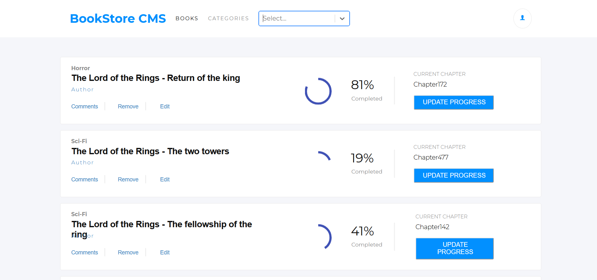

## React Calculator App

<p align="center">
  
</p>

## Live Version

* [Live Demo](https://calculator-pwa-scs.herokuapp.com/) 

<br />

## Table of Contents

<br />

* [About the Project](#about-the-project)
* [Built With](#built-with)
* [How to play](#how-to-play) 
* [Contributing](#contributing)
* [Contact](#authors)
* [Acknowledgements](#acknowledgements) 
* [Getting Started](#getting-started) 
* [Live Demo](#live-version) 

<br />

 <br/>
 <br/>
 <br/>

## Screenshot

<p align="center">
  
</p>

### Built With

* [JAVASCRIPT] [REACT] 

<br />


## About The Project

The React Calculator creates a web application capable of displaying a calculator layout face and its proper functionality to perform all necessary operations a calculator can

<br />


## Contributing

Contributions make the open-source community such an amazing place to learn, inspire, and create. Any contributions you make are **greatly appreciated**.

## Prerequisites

Terminal or similar to execute the program.


## Getting Started


## Clone project
- To get a local copy up and running follow these simple example steps.
- Clone this repository with git clone ```https://github.com/sergiocortessat/React_Calculator1/``` using your terminal or command line.
- Change to the project directory by entering: ```cd React_Calculator1``` in the terminal.
- Enter the command npm i
- Enter the project folder and run locally by using npm start.

## Command line steps
```
- $ git clone `$ git clone https://github.com/sergiocortessat/React_Calculator1/
- $ git checkout develop
- $ cd React_Calculator1
- $ npm i
- $ npm start
```

## Testing

The testing has been performed using Jest Framework. 

- To run the test please open the command line
- Enter npm run test to run the testing once.
- Enter npm run watch to keep jest test open

```
- $ cd React_Calculator1
- $ npm run test

```


## Authors

👤 Sergio Cortes Satizabal

- Github: [@sergiocortessat](https://github.com/sergiocortessat)
- Twitter: [@sergiocortessat](https://twitter.com/sergiocortessat)
- LinkedIn: [@sergiocortessat](https://linkedin.com/in/sergiocortessat)


<!-- ACKNOWLEDGEMENTS -->
## Acknowledgements

* [Microverse](https://www.microverse.org/)

## 📝 License

This project is [MIT](https://github.com/sergiocortessat/sergiocortessat/blob/main/LICENSE) licensed.
